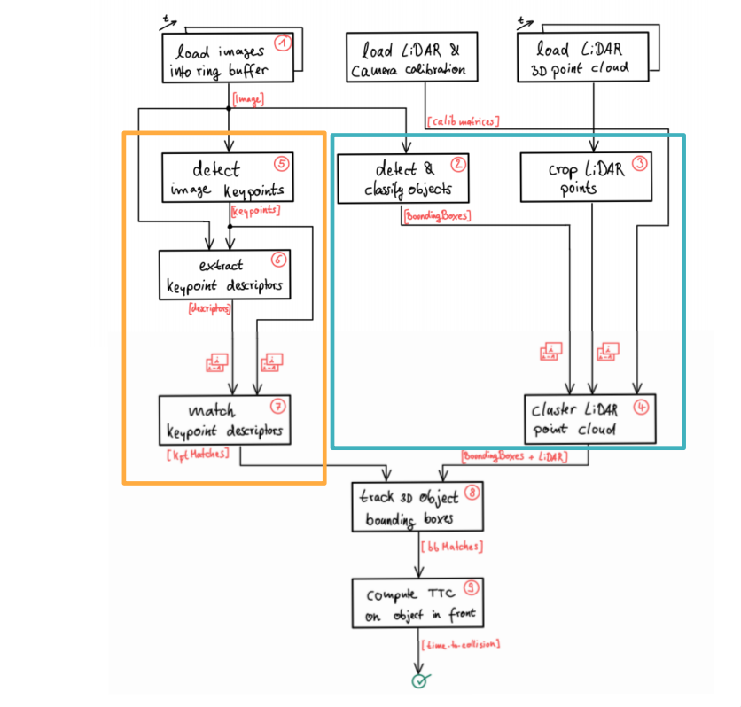

# SFND 3D Object Tracking

In this project keypoint detectors, descriptors are ran over camera images, and methods to match them between successive images are implemeted. Also, object detection is done over camera imagesusing the YOLO deep-learning framework. And finally, regions in a camera image are associated with Lidar points in 3D space. The following diagram explains the project flow.

Apart from the above mentioned details the following are also implemented:
1. First, a workflow is implemeted to match 3D objects over time by using keypoint correspondences. 
2. Second, computed the TTC (Time To Collision) based on Lidar measurements. 
3. TTC using the camera is also calculated, which requires to first associate keypoint matches to regions of interest and then to compute the TTC based on those matches. 
4. And lastly, conducted various tests with the framework. Identified the most suitable detector/descriptor combination for TTC estimation. Included in repo is a detailed report on this "Writeup_Track_3D_Object_In_Space.pdf". 

## Dependencies for Running Locally
* cmake >= 2.8
  * All OSes: [click here for installation instructions](https://cmake.org/install/)
* make >= 4.1 (Linux, Mac), 3.81 (Windows)
  * Linux: make is installed by default on most Linux distros
  * Mac: [install Xcode command line tools to get make](https://developer.apple.com/xcode/features/)
  * Windows: [Click here for installation instructions](http://gnuwin32.sourceforge.net/packages/make.htm)
* OpenCV >= 4.1
  * This must be compiled from source using the `-D OPENCV_ENABLE_NONFREE=ON` cmake flag for testing the SIFT and SURF detectors.
  * The OpenCV 4.1.0 source code can be found [here](https://github.com/opencv/opencv/tree/4.1.0)
* gcc/g++ >= 5.4
  * Linux: gcc / g++ is installed by default on most Linux distros
  * Mac: same deal as make - [install Xcode command line tools](https://developer.apple.com/xcode/features/)
  * Windows: recommend using [MinGW](http://www.mingw.org/)

## Basic Build Instructions

1. Clone this repo.
2. Make a build directory in the top level project directory: `mkdir build && cd build`
3. Compile: `cmake .. && make`
4. Run it: `./3D_object_tracking`.